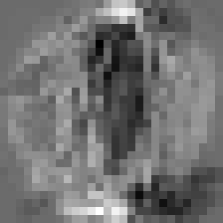

# The Perceptron

Supervised learning of binary classifiers in Golang. An homage to the work of [Frank Rosenblatt][], the father of deep learning.

### References
- The header image consists of the weights of a trained perceptron that recognizes handwritten 0's and 1's
- [Future Computers Will Be Radically Different](https://www.youtube.com/watch?v=GVsUOuSjvcg)
- [The perceptron: a probabilistic model for information storage and organization in the brain](https://www.ling.upenn.edu/courses/cogs501/Rosenblatt1958.pdf)
- [Basic Handwritten Math Symbols Dataset](https://github.com/wblachowski/bhmsds)

[Frank Rosenblatt]: https://en.wikipedia.org/wiki/Frank_Rosenblatt
